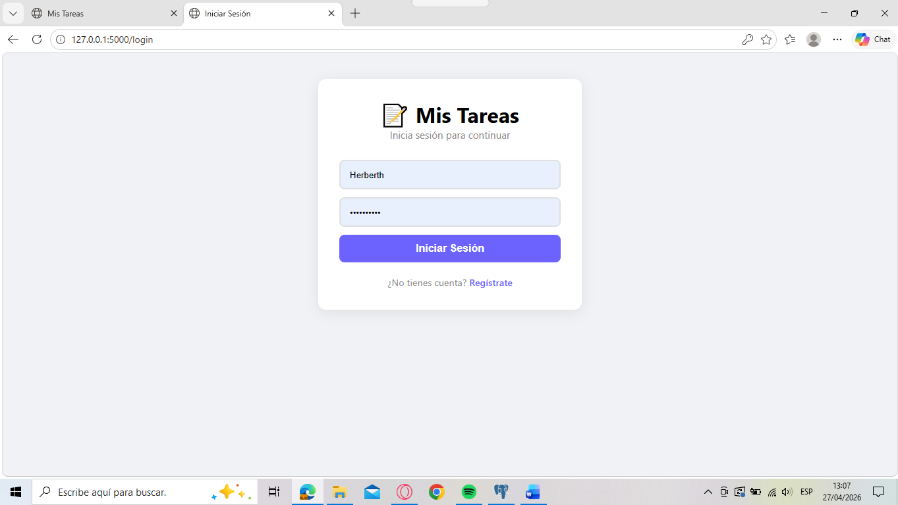
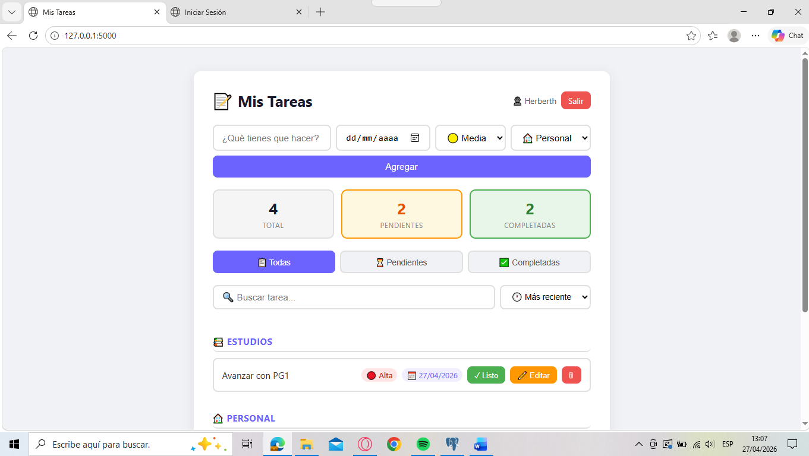

# 📝 Todo App — Gestor de Tareas Personal

Aplicación web fullstack para gestionar tareas personales, construida con Flask, PostgreSQL y JavaScript vanilla.

---

## 📸 Vista previa

### Login

### App principal

## ✨ Funcionalidades

- ✅ Registro e inicio de sesión de usuarios
- ✅ Cada usuario ve únicamente sus propias tareas
- ✅ Crear, editar y eliminar tareas
- ✅ Fechas límite y prioridades (Alta, Media, Baja)
- ✅ Categorías (Trabajo, Estudios, Personal)
- ✅ Filtros por estado (Pendientes / Completadas)
- ✅ Búsqueda en tiempo real
- ✅ Ordenamiento por fecha, prioridad o nombre
- ✅ Contador de tareas en tiempo real

---

## 🛠️ Tecnologías utilizadas

| Capa | Tecnología |
|------|-----------|
| Frontend | HTML, CSS, JavaScript (ES6) |
| Backend | Python, Flask, Flask-Login |
| Base de datos | PostgreSQL |
| Seguridad | Werkzeug (hash de contraseñas) |

---

## 🚀 Instalación local

### Requisitos previos
- Python 3.x
- PostgreSQL 16

### Pasos

1. Clona el repositorio
bash
git clone https://github.com/Danielito2252/Gestor-Tareas-.git
cd Gestor-Tareas-Personal

2. Crea y activa el entorno virtual
bash
python -m venv venv
venv\Scripts\activate  # Windows

3. Instala las dependencias
bash
pip install -r requirements.txt

4. Crea el archivo de configuración
bash
# Crea un archivo config.py con tus credenciales de PostgreSQL

python
DB_CONFIG = {
    "host": "localhost",
    "port": 5432,
    "database": "Gestor-Tareas",
    "user": "postgres",
    "password": "TU_CONTRASEÑA"
}

5. Crea la base de datos en PostgreSQL
sql
CREATE DATABASE Gestor-Tareas;

6. Corre la aplicación
bash
python app.py

7. Abre en tu navegador

http://127.0.0.1:5000

---

## 📁 Estructura del proyecto

Gestor-Tareas-Personal/
│
├── static/
│   ├── style.css        # Estilos de la aplicación
│   └── script.js        # Lógica del frontend
│
├── templates/
│   ├── index.html       # Página principal
│   ├── login.html       # Página de inicio de sesión
│   └── registro.html    # Página de registro
│
├── app.py               # Backend principal (Flask)
├── config.py            # Configuración de base de datos (no incluido en repo)
├── requirements.txt     # Dependencias del proyecto
├── Procfile             # Configuración para despliegue
└── README.md            # Este archivo

---

## 🔐 Variables de entorno

Para producción, configura las siguientes variables de entorno:

| Variable | Descripción |
|----------|-------------|
| `DB_HOST` | Host de PostgreSQL |
| `DB_PORT` | Puerto de PostgreSQL |
| `DB_NAME` | Nombre de la base de datos |
| `DB_USER` | Usuario de PostgreSQL |
| `DB_PASSWORD` | Contraseña de PostgreSQL |

---

## 👨‍💻 Autor

**Herberth Daniel Barrios Barrientos** — Estudiante de Ingeniería en Sistemas, 9no ciclo

---

## 📌 Nota

Este proyecto fue desarrollado como parte de mi portafolio personal para demostrar habilidades en desarrollo web fullstack.